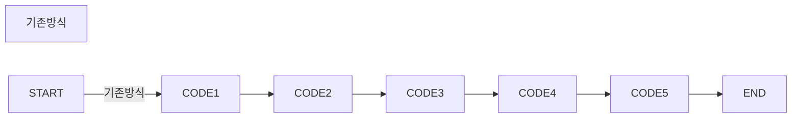
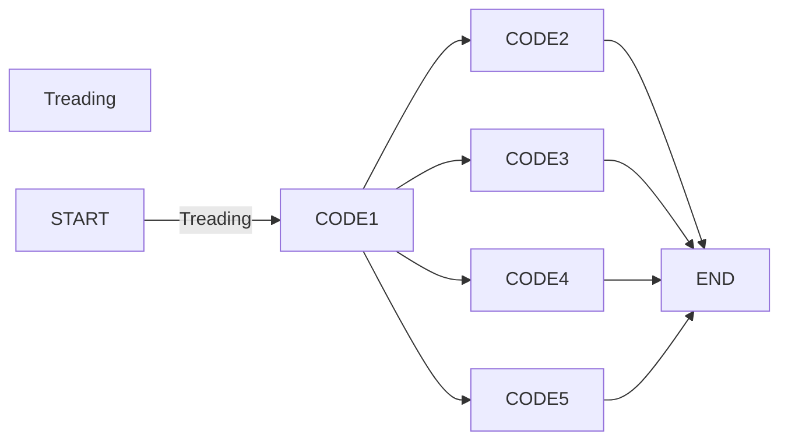

# 해당 모듈을 쓰는 이유와 간단한 사용법

# 1. 쓰레드
## 1.1. 용도 
**기존의 파이썬 코드**는 한번에 ``한 작업씩(한 줄씩)`` 차례대로 내려가면서 작업했다,   
그래서 한번에 `여러 작업을 하기 위해`서는 코딩 파일을 한번에 실행시켰어야 했는데,   
`Treading` 모듈을 이용하면 `병렬`로 코드실행이 가능하다         





## 1.2. 우리가 써야하는점
결론부터 말하면 더럽게 많다고 생각한다 예를 들어 타이머 시스템이나 주기적으로   
이벤트가 발생되어야 하는 주식시스템을 예로 들수 있다.

      
## 1.3. 사용예시
간단하게 우리는 클래스에서 상속받아 사용할것이다

```py
#Example
import Treading
import time

class Test(Treading.Tread):    #Treading.Tread를 상속받는 Test 클래스를 만든다
    def run(self):             #Tread를 실행시킬때에는 보통 run함수 코드가 실행된다
        while True:            #무한반복 한다
            print("hi")        #hi를 출력한다
            time.sleep(1)      #1초 기다림

if __name__ == "__main__":
    test = Test()
    test.start()               #Test클래스 실행
    print("test")

#이렇게 실행시켰을 경우 hi가 출력됨과 동시에 test가 출력된다
#그 후 1초 간격으로 hi가 출력되는걸 볼수있다
    
    
```
결과
```terminal
test
hi
hi
hi
hi
hi
hi
hi
hi
hi
```
